# CLAUDE.md

This file provides guidance to Claude Code (claude.ai/code) when working with code in this repository.

## Change Log (Changelog)

### 2025-09-26: Project AI Context Initialization
- Added comprehensive project architecture overview and module structure
- Created Mermaid diagram for module relationships
- Enhanced module index with detailed descriptions
- Standardized development guidelines and testing strategy

## Project Vision

PaddleOCR is an industry-leading, production-ready OCR and document AI engine that converts documents and images into structured, AI-friendly data (like JSON and Markdown) with industry-leading accuracy. The project powers AI applications for everyone from indie developers and startups to large enterprises worldwide, with over 50,000 stars and deep integration into leading projects like MinerU, RAGFlow, and OmniParser.

## Architecture Overview

PaddleOCR 3.0 follows a dual-architecture design:

1. **paddleocr/** - High-level pipeline interface (3.x API) built on PaddleX framework
   - Provides unified, user-friendly pipelines for end-to-end OCR workflows
   - Supports PP-OCRv5, PP-StructureV3, PP-ChatOCRv4 and other latest models
   - Handles model downloading, caching, and inference optimization automatically

2. **ppocr/** - Low-level core library (legacy 2.x compatible)
   - Contains training, fine-tuning, and research-oriented functionality
   - Provides granular control over model architectures, losses, and optimization
   - Supports academic algorithm implementations and custom model development

3. **Deployment & Integration** - Production deployment solutions
   - Multiple deployment options: Python/C++, Docker, Mobile, Cloud
   - Hardware acceleration support: CPU, GPU, XPU, NPU
   - Service integration: REST API, gRPC, PaddleServing

## Module Structure Diagram

```mermaid
graph TD
    A["(Root) PaddleOCR"] --> B["paddleocr/"];
    A --> C["ppocr/"];
    A --> D["configs/"];
    A --> E["tools/"];
    A --> F["deploy/"];
    A --> G["tests/"];
    A --> H["benchmark/"];

    B --> B1["_models/"];
    B --> B2["_pipelines/"];
    B --> B3["_utils/"];

    C --> C1["data/"];
    C --> C2["modeling/"];
    C --> C3["losses/"];
    C --> C4["metrics/"];
    C --> C5["postprocess/"];
    C --> C6["optimizer/"];

    D --> D1["det/"];
    D --> D2["rec/"];
    D --> D3["kie/"];
    D --> D4["table/"];

    E --> E1["infer/"];
    E --> E2["end2end/"];

    F --> F1["hubserving/"];
    F --> F2["cpp_infer/"];
    F --> F3["slim/"];
    F --> F4["paddle2onnx/"];

    G --> G1["models/"];
    G --> G2["pipelines/"];

    click B "./paddleocr/CLAUDE.md" "View paddleocr module docs"
    click C "./ppocr/CLAUDE.md" "View ppocr module docs"
    click D "./configs/CLAUDE.md" "View configs module docs"
    click E "./tools/CLAUDE.md" "View tools module docs"
    click F "./deploy/CLAUDE.md" "View deploy module docs"
    click G "./tests/CLAUDE.md" "View tests module docs"
```



## Module Index

| Module | Path | Responsibility | Key Features |
|--------|------|----------------|--------------|
| **High-Level API** | `paddleocr/` | User-friendly pipeline interface | PP-OCRv5, PP-StructureV3, PP-ChatOCRv4 pipelines |
| **Core Library** | `ppocr/` | Training, research, and low-level components | Model architectures, losses, metrics, data processing |
| **Configuration** | `configs/` | Model and training configurations | YAML configs for all supported models and tasks |
| **Tools** | `tools/` | Training, evaluation, and inference scripts | Command-line tools for model lifecycle |
| **Deployment** | `deploy/` | Production deployment solutions | C++, mobile, cloud, and service deployment |
| **Testing** | `tests/` | Quality assurance and validation | Unit tests, integration tests, pipeline tests |
| **Benchmarking** | `benchmark/` | Performance evaluation | Training benchmarks and model comparisons |
| **Legacy Structure** | `ppstructure/` | Document parsing (v2.x, deprecated) | Migrated to PP-StructureV3 in paddleocr/ |

## Running and Development

### Installation
```bash
# Core OCR functionality
pip install paddleocr

# With document parsing
pip install paddleocr[doc-parser]

# With information extraction
pip install paddleocr[ie]

# With translation
pip install paddleocr[trans]

# All features
pip install paddleocr[all]

# Development installation
pip install -r requirements.txt
pip install -e .
```

### Common Commands

#### High-Level Pipeline Usage (Recommended)
```bash
# Text recognition
paddleocr --image_dir <image_path> --lang ch

# Document parsing
python -c "from paddleocr import PPStructureV3; parser = PPStructureV3(); result = parser('<pdf_path>')"

# Information extraction
python -c "from paddleocr import PPChatOCRv4Doc; extractor = PPChatOCRv4Doc(); result = extractor('<image_path>', '<query>')"
```

#### Low-Level Training and Research
```bash
# Training
python tools/train.py -c <config_file>

# Evaluation
python tools/eval.py -c <config_file> -o Global.pretrained_model=<model_path>

# Inference
python tools/infer_det.py -c <config_file> -o Global.pretrained_model=<model_path> Global.infer_img=<image_path>

# Export model
python tools/export_model.py -c <config_file> -o Global.pretrained_model=<model_path> Global.save_inference_dir=<output_dir>
```

## Testing Strategy

### Test Organization
- **Unit Tests**: Component-level testing in `tests/models/` and `tests/pipelines/`
- **Integration Tests**: End-to-end pipeline testing
- **Resource-Intensive Tests**: Marked with `@pytest.mark.resource_intensive`

### Running Tests
```bash
# All tests (excluding resource-intensive)
pytest tests/

# Specific test module
pytest tests/pipelines/test_ocr.py

# Including resource-intensive tests
pytest tests/ -m ""

# Single test with verbose output
pytest tests/test_specific.py -v -s
```

### Test Guidelines
- Use the test-runner agent for executing tests
- Tests must be accurate and reflect real usage
- Design verbose tests for debugging purposes
- No mock services - test against real implementations
- Each function must have corresponding tests

## Coding Standards

### Architecture Principles
- **Separation of Concerns**: Clear distinction between high-level pipelines (paddleocr/) and low-level components (ppocr/)
- **Backward Compatibility**: ppocr/ maintains 2.x compatibility while paddleocr/ provides modern 3.x interface
- **Configuration-Driven**: All models and training procedures configurable via YAML files
- **Modular Design**: Pluggable components for models, losses, metrics, and data processing

### Code Style
- Follow PaddlePaddle framework conventions
- Use type hints for function parameters and return values
- Comprehensive docstrings for all public APIs
- Consistent naming patterns across modules
- No code duplication - reuse existing functions and constants

### Development Workflow
1. **Analysis**: Understand existing patterns before implementing
2. **Minimal Changes**: Implement the most concise solution with minimal code changes
3. **Testing**: Write tests before implementation when possible
4. **Documentation**: Update relevant documentation
5. **Integration**: Ensure compatibility with both paddleocr/ and ppocr/ interfaces

## AI Usage Guidelines

### Context Optimization
- Use sub-agents for specialized tasks:
  - **file-analyzer**: For reading and summarizing files
  - **code-analyzer**: For code analysis and bug tracing
  - **test-runner**: For executing tests and analyzing results
- Batch file operations when possible
- Prioritize high-signal information extraction

### Model Integration
- Understand the dual-architecture: paddleocr/ (user interface) vs ppocr/ (core implementation)
- When adding new models, implement in ppocr/ first, then expose via paddleocr/ pipelines
- Follow existing patterns for model registration and configuration
- Consider deployment implications (C++, mobile, cloud compatibility)

### Performance Considerations
- OCR operations are compute-intensive - optimize for inference speed
- Memory management is critical for large documents
- Support for heterogeneous hardware (CPU, GPU, XPU, NPU)
- Batch processing capabilities for high-throughput scenarios

### Error Handling Philosophy
- **Fail fast** for critical configuration errors
- **Log and continue** for optional features
- **Graceful degradation** when external services are unavailable
- **User-friendly messages** with actionable guidance

## 常用命令

### 配置文件实例
- **path**: `./configs/PP-OCRv5_server_rec_tyjt.yml`

### 训练相关
- **训练模型**: `python tools/train.py -c <config_file>`
- **分布式训练**: `python -m paddle.distributed.launch --gpus '0,1,2,3' tools/train.py -c <config_file>`
- **评估模型**: `python tools/eval.py -c <config_file> -o Global.pretrained_model=<model_path>`

### 推理和预测
- **文本检测**: `python tools/infer_det.py -c <config_file> -o Global.pretrained_model=<model_path> Global.infer_img=<image_path>`
- **文本识别**: `python tools/infer_rec.py -c <config_file> -o Global.pretrained_model=<model_path> Global.infer_img=<image_path>`
- **系统预测**: `python tools/infer/predict_system.py --image_dir=<image_path> --det_model_dir=<det_model> --rec_model_dir=<rec_model>`

### 模型导出
- **导出推理模型**: `python tools/export_model.py -c <config_file> -o Global.pretrained_model=<model_path> Global.save_inference_dir=<output_dir>`

### 安装和环境
- **安装依赖**: `pip install -r requirements.txt`
- **安装PaddleOCR**: `pip install paddleocr`

## 代码架构概览

### 主要目录结构
- **paddleocr/**: 新版本OCR库，提供高级接口和管道化功能
  - `_models/`: 各种模型实现（检测、识别、分类等）
  - `_pipelines/`: 处理管道（OCR、文档结构化、ChatOCR等）
- **ppocr/**: 传统OCR核心库，包含训练和推理代码
  - `data/`: 数据加载和预处理
  - `modeling/`: 深度学习模型架构
  - `losses/`: 各种损失函数
  - `metrics/`: 评估指标
  - `postprocess/`: 后处理算法
- **configs/**: 各种模型和任务的配置文件
- **tools/**: 训练、评估、推理工具脚本
- **deploy/**: 部署相关代码（C++、移动端、服务化等）
- **docs/**: 文档资源
- **tests/**: 测试代码

### 核心功能模块
1. **文本检测**: DB、EAST、PSE、SAST等算法
2. **文本识别**: CRNN、SVTR、ABINet等算法
3. **文档结构化**: 表格识别、版面分析、公式识别
4. **关键信息提取**: LayoutLM系列模型
5. **端到端OCR**: PGNet等算法

### 模型配置系统
- 配置文件采用YAML格式，位于`configs/`目录
- 支持全局配置、架构配置、损失函数配置、优化器配置等
- 配置文件按任务类型分类：det（检测）、rec（识别）、cls（分类）、kie（关键信息提取）等

### 数据处理流程
1. **数据加载**: 支持LMDB、简单数据集等格式
2. **数据增强**: 丰富的图像变换和增强策略
3. **标签处理**: 各种标签格式的转换和处理
4. **批次整理**: collate_fn处理变长数据

### 训练流程
1. **配置解析**: 从YAML文件加载配置
2. **数据准备**: 创建数据加载器
3. **模型构建**: 根据配置构建网络架构
4. **优化器设置**: 配置学习率调度和优化策略
5. **训练循环**: 前向传播、损失计算、反向传播
6. **模型保存**: 定期保存检查点和最佳模型

## 开发注意事项

### 添加新模型
- 在`ppocr/modeling/`对应目录下添加模型实现
- 在`__init__.py`中注册新模型
- 创建对应的配置文件在`configs/`目录
- 添加相应的损失函数和后处理方法

### 添加新数据集
- 在`ppocr/data/`下实现数据集加载器
- 实现必要的数据预处理和标签转换
- 更新配置文件以使用新数据集

### 代码风格
- 使用PaddlePaddle深度学习框架
- 遵循现有的代码结构和命名规范
- 添加适当的文档字符串和注释

## 开发指导原则

> Think carefully and implement the most concise solution that changes as little code as possible.

## USE SUB-AGENTS FOR CONTEXT OPTIMIZATION

### 1. Always use the file-analyzer sub-agent when asked to read files.
The file-analyzer agent is an expert in extracting and summarizing critical information from files, particularly log files and verbose outputs. It provides concise, actionable summaries that preserve essential information while dramatically reducing context usage.

### 2. Always use the code-analyzer sub-agent when asked to search code, analyze code, research bugs, or trace logic flow.

The code-analyzer agent is an expert in code analysis, logic tracing, and vulnerability detection. It provides concise, actionable summaries that preserve essential information while dramatically reducing context usage.

### 3. Always use the test-runner sub-agent to run tests and analyze the test results.

Using the test-runner agent ensures:

- Full test output is captured for debugging
- Main conversation stays clean and focused
- Context usage is optimized
- All issues are properly surfaced
- No approval dialogs interrupt the workflow

## Philosophy

### Error Handling

- **Fail fast** for critical configuration (missing text model)
- **Log and continue** for optional features (extraction model)
- **Graceful degradation** when external services unavailable
- **User-friendly messages** through resilience layer

### Testing

- Always use the test-runner agent to execute tests.
- Do not use mock services for anything ever.
- Do not move on to the next test until the current test is complete.
- If the test fails, consider checking if the test is structured correctly before deciding we need to refactor the codebase.
- Tests to be verbose so we can use them for debugging.


## Tone and Behavior

- Criticism is welcome. Please tell me when I am wrong or mistaken, or even when you think I might be wrong or mistaken.
- Please tell me if there is a better approach than the one I are taking.
- Please tell me if there is a relevant standard or convention that I appear to be unaware of.
- Be skeptical.
- Be concise.
- Short summaries are OK, but don't give an extended breakdown unless we are working through the details of a plan.
- Do not flatter, and do not give compliments unless I am specifically asking for your judgement.
- Occasional pleasantries are fine.
- Feel free to ask many questions. If you are in doubt of my intent, don't guess. Ask.

## ABSOLUTE RULES:

- NO PARTIAL IMPLEMENTATION
- NO SIMPLIFICATION : no "//This is simplified stuff for now, complete implementation would blablabla"
- NO CODE DUPLICATION : check existing codebase to reuse functions and constants Read files before writing new functions. Use common sense function name to find them easily.
- NO DEAD CODE : either use or delete from codebase completely
- IMPLEMENT TEST FOR EVERY FUNCTIONS
- NO CHEATER TESTS : test must be accurate, reflect real usage and be designed to reveal flaws. No useless tests! Design tests to be verbose so we can use them for debuging.
- NO INCONSISTENT NAMING - read existing codebase naming patterns.
- NO OVER-ENGINEERING - Don't add unnecessary abstractions, factory patterns, or middleware when simple functions would work. Don't think "enterprise" when you need "working"
- NO MIXED CONCERNS - Don't put validation logic inside API handlers, database queries inside UI components, etc. instead of proper separation
- NO RESOURCE LEAKS - Don't forget to close database connections, clear timeouts, remove event listeners, or clean up file handles
- Response in Chinese, but write markdown files in English